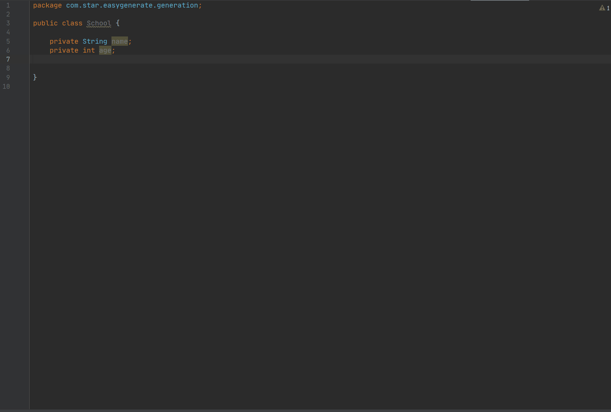
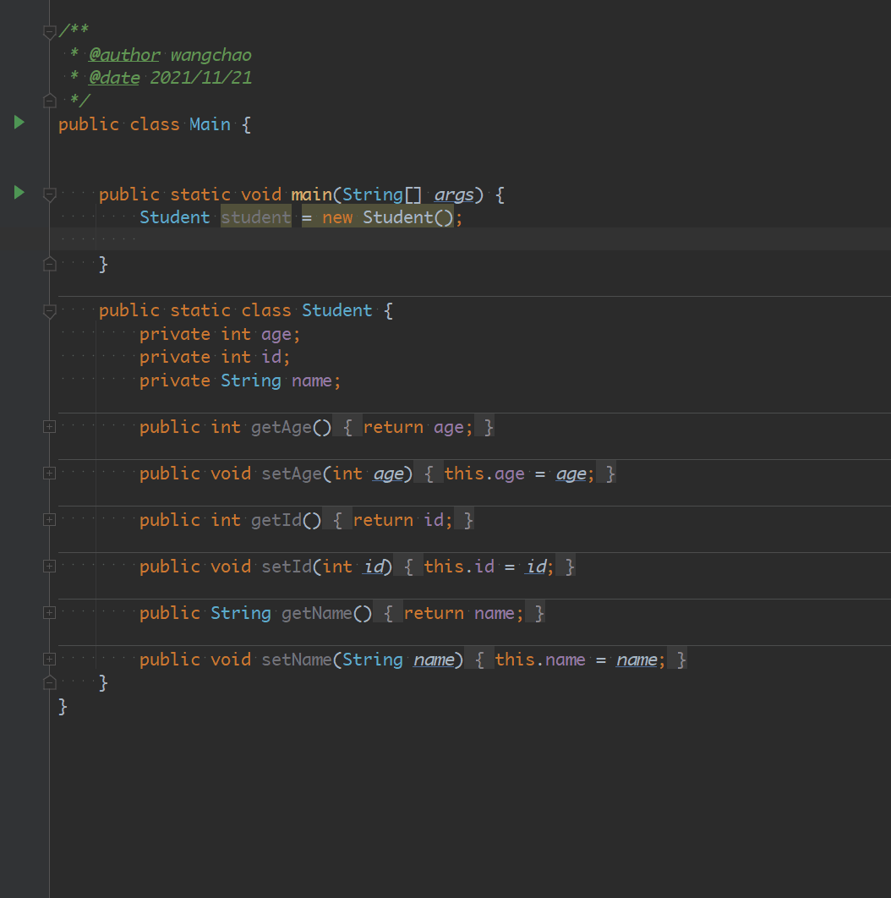
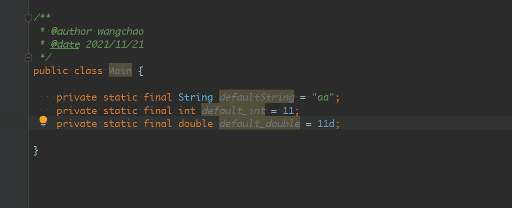
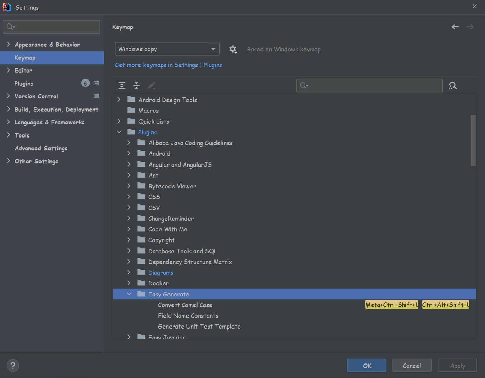

# easy_generate 点一下star✨，是对作者最大的支持 
# 交流Q群：733688083

## 介绍
- 快速生成变量的常量代码
- 快速生成单元测试代码
- 快速生成setter方法
- 变量驼峰、大小写、下划线等转换
- java类和json相互转换 快捷键：alt shift J

## Gif图
- 生成变量的常量代码

- 生成setter方法

- 变量驼峰、大小写、下划线等转换

## 安装
IDEA插件市场搜索 `Easy Generate` 即可

## 使用方法
- 常量代码: 使用快捷键调出代码生成Generate（同生成Getter、Setter的快捷键），或者 右键->Generate...，选择"Field Name Constants"。生成变量的常量。
    - win: alt + insert
    - mac: control + n
- 单元测试代码: 使用快捷键调出代码生成Generate（同生成Getter、Setter的快捷键），或者 右键->Generate...，选择"Generate Unit Test Template"。生成单元测试模板。
    - win: alt + insert
    - mac: control + n
- 生成setter方法: **光标放在变量上**，使用快捷键，选择`Genetate all setter`或者`Genetate all setter with default`
  - win: alt + enter
  - mac: option + enter
- 驼峰转换: **光标放在变量上**，使用快捷键
  - win: alt + shift + u
  - mac: option + shift + u
- java和json相互转换: 使用快捷键，可以将光标放在类名上或者json文件中
  - win: alt + shift + j
  - mac: alt + shift + j
- 以上所有快捷键都可以在IDEA设置中修改
  - 
